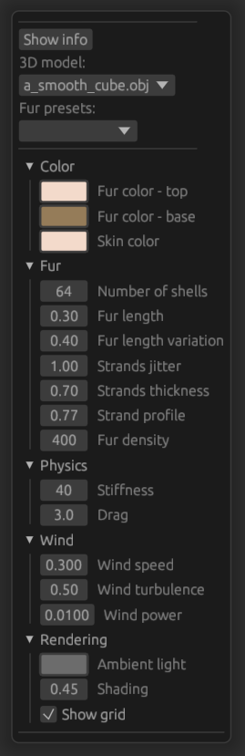
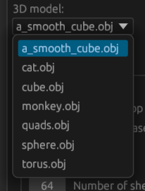
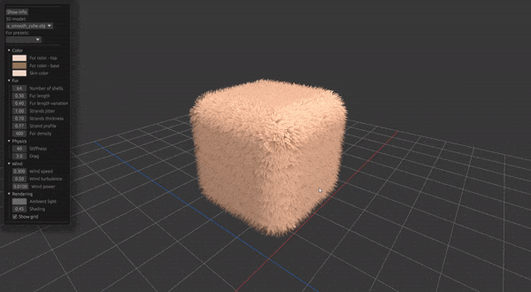
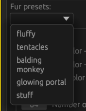
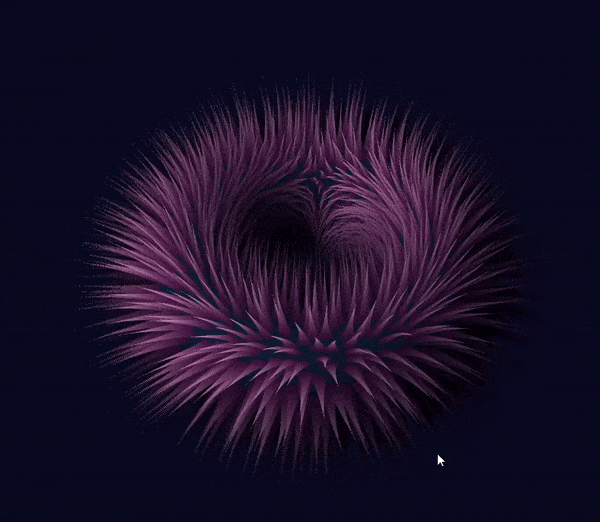
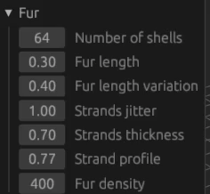

# Shell Texturing Toy

## Download
See the releases tab to the right ->

## Features
### Rich inspector letting you edit:
* Fur color
* Fur parameters
* Wind
* Lighting

### Loading your `.obj`s from files

### 3D View letting you see and move the mesh
### Fur physics in response to mesh movement

### A bunch of fur presets

### loading settings from the config file

## Known issues
When you try to import a mesh that is not triangulated, the program ignores it. Triangulate your `.obj`s in external software before importing it.

## Controls
|       Action      |     Result    |
|:-----------------:|:-------------:|
|      Drag LMB     | Rotate camera |
|      Drag RMB     |   Pan camera  |
| LShift + Drag LMB |  Move object  |

## UI
The textboxes can be either clicked and the edited using keyboard, or dragged left-right OR up-down.

